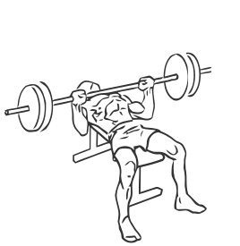
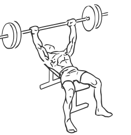

# Bench Press
> This is an exercise for the chest.

``` 
id: 0042 
type: compound 
primary: chest 
secondary: triceps 
equipment: bench, barbell 
``` 

## Steps

 - Lie on a flat bench with your feet flat on the floor, keep your back flat on the bench.
 - Grasp the bar a little wider than shoulder width apart.
 - Raise the barbell above your body and move it over the middle of your chest, this is your starting position.
 - Lower the bar down so it just touches your chest.
 - Raise the bar till your arms are fully extended and your elbows are locked.
 - Return to starting position.

## Tips

 - none

## Images




