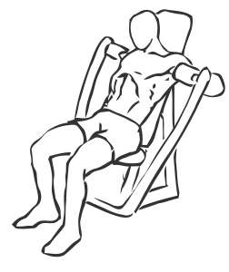
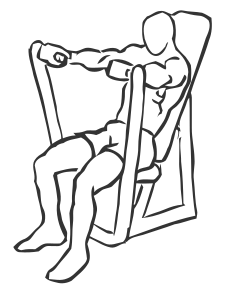

# Machine Bench Press
> This is an exercise for chest, biceps and shoulder strengthening.

``` 
id: 0066 
type: isolation 
primary: chest 
secondary: triceps,shoulders 
equipment: bench press machine 
``` 

## Steps

 - Adjust the machine so that you are sitting with the bars at chest height.
 - Place your hands on the bars and place your feet on the foot rest.
 - Press out, extending your arms as far as possible in a steady motion.
 - Pause for a moment and then return slowly to starting position.

## Tips

 - none

## Images




