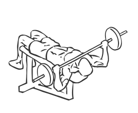
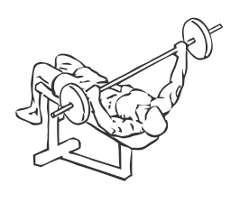

# Barbell Neck Press
> This is an advanced exercise for chest strengthening.

``` 
id: 0067 
type: isolation 
primary: chest 
secondary: biceps 
equipment: barbell, flat bench 
``` 

## Steps

 - Lie on a flat bench with you feet planted firmly on the floor.
 - Grasp the bar a little wider than shoulder width apart.
 - Raise the barbell above your body and move it to the top of your chest, near your neck.
 - This is your starting position.
 - Lower the bar down so it just touches the top of your chest.
 - Raise the bar till your arms are fully extended and your elbows are locked.
 - Return to starting position.
 - Repeat.

## Tips

 - none

## Images




