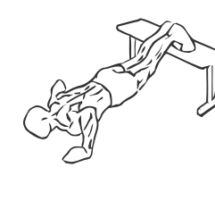
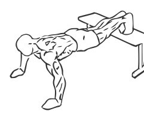

# Push Up with Feet Elevated
> 

``` 
id: 0075 
type:  
primary:  
secondary: none 
equipment:  
``` 

## Steps

 - This is the same general movement as with a Push Up except your feet are elevated allowing greater range of motions and targeting the pectorals differently than the regular Push Up.
 - Place your feet on a bench at least 18” off the ground.
 - Make sure the tops of your feet are flush against the bench.
 - Place your hands on the floor slightly wider than shoulder width apart.
 - With your hands directly under your shoulders, press up from the floor, keeping your back and neck in a straight line so you are looking forward during the entire exercise.
 - Once your arms are fully extended pause and then with slow controlled movements lower yourself to the floor again.

## Tips

 - none

## Images




