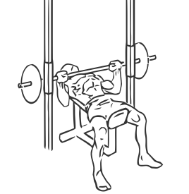
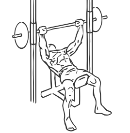

# Smith Machine Incline Bench Press
> This is an exercise for chest, shoulder and triceps strengthening.

``` 
id: 0081 
type: isolation 
primary: chest 
secondary: shoulders,triceps 
equipment: smith machine, incline bench 
``` 

## Steps

 - Place an incline bench at a 45 degree angle in the middle of the Smith Machine.
 - Align the bench so the bar is across the upper portion of your chest.
 - Grasp the bar with a shoulder width grip.
 - Unlock the bar and slowly lower the weight to your chest, do not bounce the bar on your chest.
 - With slow controlled movements, raise the bar back to the starting position.

## Tips

 - when you are doing this exercise for the first time, start on a lower weight in oder to perfect the technique.

## Images




