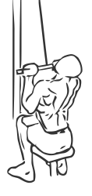

# Underhand Pull downs
> This is an exercise for lats and biceps strengthening.

``` 
id: 0093 
type: isolation 
primary: lats 
secondary: biceps 
equipment: cable machine 
``` 

## Steps

 - Sitting upright with your abs drawn in grasp a Pull Down bar with and underhand grip shoulder width apart.
 - Pull the bar down till the bar reaches your upper chest, keeping your elbows close to your body.
 - Slowly return the bar to the starting position.
 - Repeat.

## Tips

 - none

## Images



