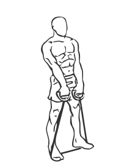
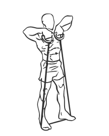

# Upright Band Rows
> This is an exercise for lats, triceps and shoulder strengthening.

``` 
id: 0094 
type: isolation 
primary: lats 
secondary: triceps,shoulders 
equipment: body, bands 
``` 

## Steps

 - Stand on the band so that the handles are level with your upper thigh.
 - With your back straight and abs drawn in raise your hands upward to your collarbone.
 - Your elbows and arms should be parallel with the floor.
 - Slowly lower your arms and return to starting position.

## Tips

 - none

## Images




