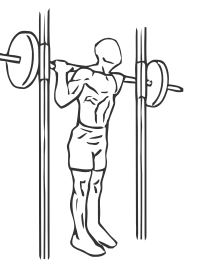
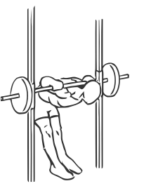

# Smith Machine Good Mornings
> This exercise utilises the same technique of the standard Good Mornings yet the use of the Smith Machine provides more stability.

``` 
id: 0102 
type: isolation 
primary: lower back 
secondary: hamstrings 
equipment: smith machine 
``` 

## Steps

 - Place a barbell across your shoulders.
 - Keeping your head up and your back completely straight, bend at the waist until your back is parallel with the floor.
 - Return to starting position.
 - Repeat.

## Tips

 - none

## Images




