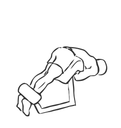
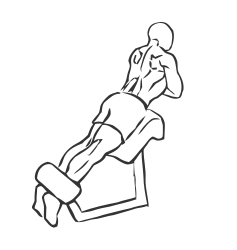

# Hyperextensions
> This exercise not only adds strength but also flexibility to the back and core muscles.

``` 
id: 0103 
type: isolation 
primary: lower back 
secondary: hamstrings,core 
equipment: hyperextension bench 
``` 

## Steps

 - Adjust the hyperextension bench so that your ankles are tucked under the footpads and your thighs are flat across the top pad.
 - With your arms folded across your chest and your back straight, slowly bend at the waist towards the floor, keeping your back flat.
 - Slowly return to the starting position.
 - Repeat.

## Tips

 - none

## Images




