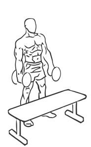
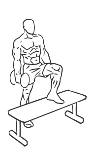

# Step Ups with Dumbbells
> This exercise builds coordination as well as muscle.

``` 
id: 0137 
type: compound 
primary: quadriceps 
secondary: calves,hamstrings 
equipment: dumbbells 
``` 

## Steps

 - Place a bench, box or step in front of you.
 - Grasp a dumbbell in each hand.
 - With your left leg, step up on the bench, and follow by stepping up with your right leg.
 - Step down with your left leg and then your right leg.
 - Repeat starting with your right leg.
 - Note: Use a lighter weight until you are used to the motion of this exercise.

## Tips

 - none

## Images




