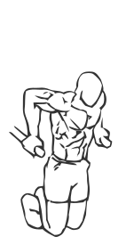
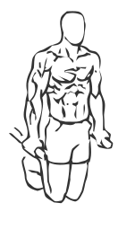

# Tricep Dips using Body Weight
> This classic exercise uses the weight of your own body to work your triceps.

``` 
id: 0172 
type: compound 
primary: triceps 
secondary: shoulders,chest 
equipment: body 
``` 

## Steps

 - Grasp a set of parallel bars and push yourself up to the starting position.
 - Keeping your elbows close to your body, lower yourself down until your triceps are parallel to the floor.
 - Slowly raise yourself back to the starting position.
 - Note: Keep your abs drawn in and your body straight during this exercise.

## Tips

 - none

## Images




