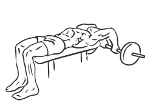
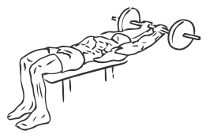

# Lying Close-Grip Triceps Extension Behind the Head with Barbell
> You can use a barbell or EZ bar to further concentrate the benefit to your triceps.

``` 
id: 0179 
type: isolation 
primary: triceps 
secondary: none 
equipment: barbell 
``` 

## Steps

 - You can use a barbell or EZ (curl) bar to further concentrate the benefit to your triceps.
 - Lie flat on a bench on your back.
 - Grasp the bar with a grip approximately 8 inches apart and lower the bar behind your head.
 - Keeping the bar parallel with the floor, bend your arms down in an arc so the bar moves in a direction under your head.
 - Slowly return to starting position.

## Tips

 - none

## Images




