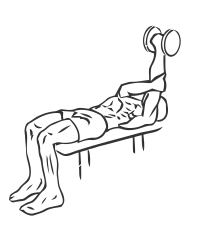

# Single Arm Pronated Triceps Extension with Dumbbell
> This is an advanced exercise to isolate and work the tricep muscles.

``` 
id: 0186 
type: isolation 
primary: triceps 
secondary: none 
equipment: dumbbell 
``` 

## Steps

 - This is an advanced exercise to isolate and work the tricep (back of the arm) muscles.
 - Lie flat in a bench with your head at one end and your feet placed firmly on the floor.
 - Grasp a dumbbell in one hand and raise it to a position above your chest, with your palm facing your feet.
 - Place your free hand under the shoulder to support your other arm.
 - Slowly lower the weight moving only your forearm and elbow towards and away from your chest.
 - Repeat with your other arm.
 - Note: Practice this exercise with light weight to get used to the movements.

## Tips

 - none

## Images



