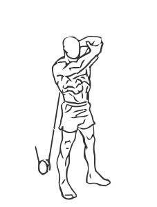
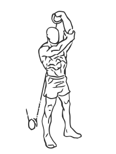

# One Arm Low-Pulley Triceps Extension with Cable
> This exercise uses a cable machine to isolate the triceps.

``` 
id: 0199 
type: compound 
primary: triceps 
secondary: none 
equipment: cable 
``` 

## Steps

 - Attach a handle to a low cable pulley machine.
 - Stand with your back to the weight stack, your feet shoulder width apart.
 - With your left hand, reach behind you and grasp the handle.
 - Place your right hand on your left elbow for support.
 - Extend your left arm straight up towards the ceiling and then lower it to the starting position.
 - Repeat and switch arms.

## Tips

 - none

## Images




