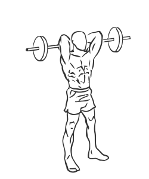
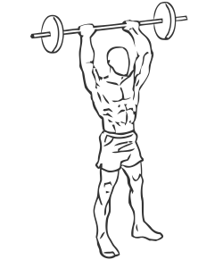

# Standing Overhead Triceps Extension with Barbell
> This is a double arm barbell version of a behind the neck triceps exercise.

``` 
id: 0201 
type: isolation 
primary: triceps 
secondary: none 
equipment: barbell 
``` 

## Steps

 - Stand with your feet shoulder width apart, your back straight and your abs drawn in.
 - Hold a barbell or EZ Curl bar about 6-8 inches apart with your palms facing up.
 - Raise the bar over your head and slowly lower the dumbbell in an arc behind your head, towards your back.
 - Slowly raise the bar back up to the starting position.
 - Note: Keep your elbows close to your head during the exercise

## Tips

 - none

## Images




