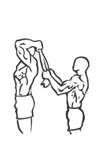
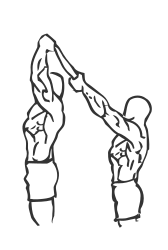

# Standing Triceps Extension with Towel
> This exercise requires another person and uses manual resistance, or your body’s own weight to build muscle.

``` 
id: 0202 
type: isolation 
primary: triceps 
secondary: none 
equipment: body 
``` 

## Steps

 - Stand with your feet shoulder width apart, your back straight and your abs drawn in.
 - Hold a towel or rope facing up behind and in back of your head.
 - Have a partner hold the towel taught during the exercise so the resistance is constant.
 - Lower your forearms down until they reach your biceps, then slowly raise your arms back up to starting position.
 - Note: Keep your elbows close to your head during the exercise.

## Tips

 - none

## Images




