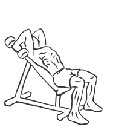
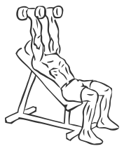

# Incline Triceps Extensions with Dumbbell
> This version of the triceps extension uses an incline bench.

``` 
id: 0209 
type: isolation 
primary: triceps 
secondary: shoulders 
equipment: dumbbell 
``` 

## Steps

 - Grasp a dumbbell in each hand and lie against an incline bench, face up with your feet firmly planted on the floor.
 - Extend your arms over your shoulders with your palms facing each other.
 - Slowly lower the dumbbells behind your head by bending your elbows.
 - With a controlled motion raise your arms back up to the starting position.

## Tips

 - none

## Images




