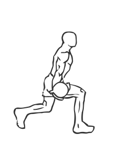
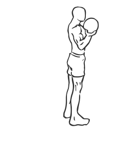

# Bicep Curl Lunge with Bowling Motion
> This exercise is similar to the motions of bowling.

``` 
id: 0262 
type:  
primary: arms 
secondary: calves,triceps,hamstrings,glutes,quadriceps 
equipment: medicine ball 
``` 

## Steps

 - Hold a Medicine Ball in one hand with your palms facing up at shoulder height.
 - Bring one foot back and into a lunge, keeping your front foot stationary and not letting your back knee touch the ground.
 - While lunging, bring the ball down and back as if you were bowling.
 - Bring your arm back up to the starting position, switch legs and repeat.
 - Note: Use slow and steady movements with this exercies.

## Tips

 - none

## Images




